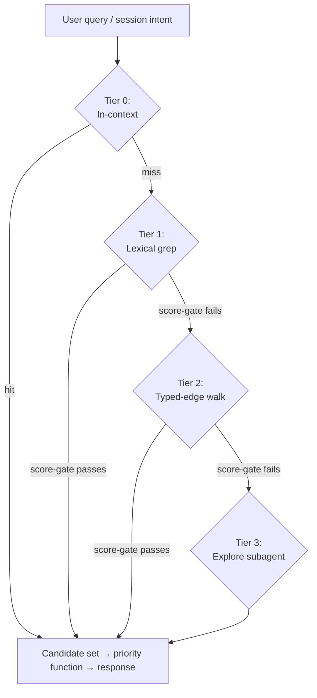

# Architecture

This explains how CORE's v2 design works and why it's built this way. The skill files are the actual contract; this is the reasoning behind them.

## How CORE changed shape

CORE started as a multi-agent reasoning framework — a `/core` skill that spun up expert-persona swarms and ran generator-critic loops to find things a single pass misses.

In May 2026 it changed shape. Now it's one capable agent that knows the project, watches its data sources, remembers across sessions, raises decisions and risks before you ask, and argues back when you're too sure. The swarm is still there, but the agent reaches for it as a tool when the stakes call for it, rather than running everything through it.

Three things changed in practice. The swarm machinery moved from the default path to an internal protocol (`protocols/analysis.md`) the agent calls when stakes warrant. Memory went from a loose mix of auto-memory, session summaries, and a `DECISIONS.md` to a structured store of facts with typed links between them and a four-tier way of retrieving them. `PROJECT.md` went from hand-edited to written from those facts, with edits detected and carried back. And plain voice became a rule the project enforces in a few places at once — the top of `SKILL.md`, the protocol headers, the agent's own self-checks, and an optional per-turn reminder hook you can add yourself.

The argue-it-out discipline didn't go anywhere. The agent still frames its predictions before reading a draft, keeps a log of what changed its mind, audits itself against four named failure modes, and runs the external-audience test before any claim about people. That holds whether it's working alone or in a swarm. What changed was the staffing, not the discipline.

## How memory works

Memory is the heart of the design. Everything else organizes around how facts get stored and found.

### Two tiers

**Tier 1 — observations** at `<project>/_memories/observations/<YYYY-MM>/obs-<timestamp>-<slug>.md`. Capture-everything. Every utterance, tool output, casual mention. Low-effort YAML frontmatter (id, type, created, session, sources, references-person, references-topic). No edges required at write time.

**Tier 2 — units** at `<project>/_memories/<prefix>-<slug>.md`, flat layout. Graduated, reasoned facts. Rich frontmatter (id, type, status, created, updated, confidence, sources, references-person, references-topic, edges, canonical, last_accessed, access_count). Body holds the agent's reasoned reading — synthesis, not raw extract.

The canonical flag (`canonical: true`) marks the top-priority units that surface in PROJECT.md and get a priority floor. Not a separate tier; a marker.

### Edge types

Edges in unit frontmatter as `{type, target, note?}`. The committed types are `cites` (generic reference), `supersedes` (replacement), `depends-on` (dependency), `conflicts-with` (contradiction), `references-person`, `references-topic`, plus `refines` (sharpens a prior decision without replacing it) and `amends` (modifies specific parts while the prior stands). Inverse forms — `depended-on-by`, `superseded-by` — close the graph where retrieval needs the back-edge.

Three are eager at write time — `supersedes`, `depends-on`, `conflicts-with` — because retrieval and hygiene depend on them. The rest are eager when clear and lazy otherwise; hygiene's reconciliation pass catches what got missed. The set is deliberately small: a new type has to carry distinct meaning, and informal near-synonyms (`relates`, `related`, `relates-to`) normalize to `cites` rather than expanding it.

### Four-tier retrieval ladder

```
Tier 0 — In-context (already loaded; no retrieval)
   ↓ miss or insufficient
Tier 1 — Lexical (Grep + Read + Glob; keyword-anchored)
   ↓
Tier 2 — Graph walk (typed-edge frontmatter; relational, hop-cap 2-3)
   ↓
Tier 3 — Semantic (Explore subagent reasoning over the vault)
```

Score-gated termination at every transition — the agent decides whether the candidate set is good enough.

Default retrieval excludes observations. Only graduated units surface unless the user explicitly queries observations.

Auto-memory at `~/.claude/projects/*/memory/` is read once at startup as harness-local warm-start hinting — scratch cache, never authoritative. The automatic per-turn retrieval path reads only `_memories/`; harness memory is not queried per tier.

### Priority function

```
priority(unit, t) = w_R · R(unit, t)
                  + w_F · F(unit, t)
                  + w_S · S(unit)
                  + w_A · A(unit, t)
                  + P(unit)
```

- **R (recency)** = `exp(-recency_days / τ)`, τ=60 days.
- **F (frequency-across-sources)** = distinct surface-types the unit appears in, normalized by 6.
- **S (source-type weight)** = lookup (PROJECT.md=1.0, configuration=0.9, ops meta=0.7, _summaries/_outputs=0.5, session logs=0.3, raw transcripts=0.2).
- **A (alignment)** = Jaccard overlap of unit's topics against session-intent topics.
- **P (pinning)** = user-only pin levels (floor=0.7 floor, true=0.9 floor & decay bypassed, always=1.5 alignment-independent).

Starting weights: `w_R=0.30, w_F=0.15, w_S=0.20, w_A=0.35`. Computed at retrieval time over a candidate set, never persisted as a stored ranked list.

### Rendering PROJECT.md from units

PROJECT.md is rendered from canonical units. Three triggers:

1. At `/finalize` — regeneration when the session materially changed §State or §Moves.
2. On-demand — any time the user asks.
3. In-session, autonomously — section-level re-render after each meaningful update affecting a section.

Section-level writes, not full-file. The agent reads the current section state, preserves user edits, propagates them back into the source-of-truth units.

The anti-resurrection rule: when the user removes a fact from PROJECT.md, that fact is gone. Don't re-derive it. The corresponding unit's `status` becomes `retired`; hygiene's retire verb fires.

### Edit detection

Hash-based comparison via `~/.core/state-cache.json`. Runs at session start (`/core`), before autonomous renders, at `/finalize`, on-demand. User edits become ground truth and propagate back to source units; CORE's own renders (the hot-section block, stamped `last_written_by`) are skipped, not mistaken for user edits.

### Validity (world-time)

A unit can carry an optional validity window — `t_valid` and `t_invalid` world-time fields marking when a fact was true in the world, separate from when CORE recorded it. Tier-2 retrieval suppresses a unit whose `t_invalid` is in the past, so an invalidated fact doesn't surface as current truth; a cold-history walk (`--include-invalid`) still reaches it. Point-in-time reconstruction (`--as-of <date>`) shows what the store held at a past moment, and impact propagation walks `depends-on` edges to flag what an invalidation touches. Units without these fields behave exactly as they did before — the dimension is additive.

## Memory hygiene

One unified mechanism, three verbs. Archive moves a unit out of default retrieval but keeps it reachable on demand — trigger is `R · S < 0.05` and no reference in 90 days, surfaced as a user-gated proposal at `/process-memory`. Retire flags a unit as no longer current truth while keeping the trace — trigger is explicit supersession or a user-removed PROJECT.md fact, and the unit stays in place with a frontmatter status flip. Cold-store puts the unit fully out-of-band — only deep historical queries reach it, trigger is archived AND retired AND no reference in 365 days.

Plus graduation (observations → units), contradiction reconciliation, index regeneration, file-cap monitoring, continuous self-evaluation.

Runs at `/process-memory` (comprehensive), on meaningful changes (lightweight, only what's triggered), on-demand, after PROJECT.md user-edit, on hash mismatch.

Every operation is logged twice — in plain prose in `<project>/autonomous-run-log.md`, and machine-readable in `<project>/_sessions/<date>/hygiene-log.jsonl`. Every operation can be undone.

Memory hygiene took over the old v1 "dream cycle" entirely. Its phases became hygiene verbs and self-checks; nothing is left as a separate ritual.

## Reasoning discipline (single-agent default)

Single-agent is the default. Most tasks run as one agent doing the work directly, with extended thinking for high-stakes judgment. The reasoning discipline applies whether you're solo or in a swarm.

| Discipline | Solo work | Swarm work |
|---|---|---|
| Anti-anchoring | You read your own predictions before re-reading source material | Critic frames before seeing Generator output |
| Dissent | Push back on user framing when evidence supports | Authorized to contradict any agent's conclusion |
| Persuasion log | Track positions you reversed and why | Mandatory output field; empty is a diagnostic signal |
| Named failure modes | Self-audit at synthesis | Explicit assessment in every effectiveness report |
| External-audience test | Before any claim about people | Same |

### When multi-agent fires

Per `protocols/analysis.md`:

- Stakes warrant the cost — architectural decisions, classification, public-facing copy, graduation reasoning on hard calls.
- Single-pass convergence would be suspect.
- Multiple perspectives genuinely add value.
- Structural commitment the user hasn't endorsed.

Sizing: 3 agents for focused checks, 4–5 for comprehensive review, 3–5 for research investigation. Critic always present. Hardware caps the upper end.

The full multi-agent machinery — phase structure, briefing format, monitor pattern, deep audit gate, output shape — lives in `protocols/analysis.md`.

## Hooks and visible curation

The plugin ships three lifecycle hooks in `plugins/core/hooks/hooks.json` — SessionStart (auto-`/core`; a wrapper entry point is honored only when registered in the user's own settings, never from a project's), UserPromptSubmit (per-turn retrieval injection, default-on, `CORE_RETRIEVAL_HOOK=0` opts out), and SessionEnd (the self-managed close). INSTALL.md §"Shipped hooks" lists each with its opt-out. Two further hooks pair well with CORE; wire either into your own `~/.claude/settings.json` (INSTALL.md §"Optional hooks" shows how):

| Hook | What it does |
|---|---|
| UserPromptSubmit | Injects the plain-voice imperative each turn to counter the coding-assistant baseline |
| PreToolUse Write/Edit | Skill-product guard — surfaces a Pre-Write Declaration reminder when writes target installed skill paths |

Showing the work is how the agent earns trust. You should always be able to watch it keep context current — saying what it just captured, re-rendering `PROJECT.md` sections as they change, appending to the run log as it goes.

## Validation

The validation regime tests three things:

1. Substrate health (parsing, edges resolving, file integrity).
2. Retrieval convergence (right candidates at the right tier).
3. Priority ranking quality (right ordering on the candidate set).

Test corpus at `<project>/_memories/_validation/tests/test-*.yaml`. Runner at `${CLAUDE_PLUGIN_ROOT}/skills/core/scripts/validate.mjs` (invoke via `node`). Thresholds: P,R ≥ 0.8 PASS, ≥ 0.5 INVESTIGATE, < 0.5 FAIL.

Cadence: on-demand — user request, or agent self-trigger when retrieval feels off; run before and after retrieval-tuning changes to measure the delta.

The validation report includes a final qualitative field: *"Did retrieval feel right in real use?"* Quantitative thresholds aren't the whole story.

## Self-measurement

CORE measures how well it recognizes a project across sessions. A per-turn classifier labels each turn with one of six recognition states; a daily rollup aggregates them and writes a one-line signal that the readiness summary surfaces when recognition is slipping. Companion detectors flag non-resolving citations, stale context, and anticipation gaps.

Capture runs by default and writes only to local disk under `<project>/_metrics/` — nothing leaves the machine. Opt out per workspace with `metrics_enabled: false` in `workspace.json`, or globally with `CORE_METRICS_ENABLED=0`.

The classifier is **PROVISIONAL**. It isn't calibrated, so the readiness summary only flags an *upward* recognition-failure trend — never an absolute level — and every surface that shows the signal says PROVISIONAL. Calibration clears once a human-labeled set reaches a 0.7-precision gate, and that precision is computed only from the labels, never from the classifier's own output.

`/metrics` is the user-facing surface for all of this: a live health check that builds a throwaway scratch store, proves the write→validate→index→retrieve→suppress round trip fresh on every run, then reads this project's real validator counts, unit census, retrieval-log coverage, recognition signal, and calibration-pool progress — each rendered as a bar gauge with an honest trust label (proven-live / direct / provisional), never a bare number pretending to be more certain than it is.

## What ships vs. what lives where

| Surface | Where it lives |
|---|---|
| Skill product (this plugin) | Installed via `/plugin install core@core` into `~/.claude/plugins/cache/<marketplace>/core/<version>/skills/core/`. Legacy direct-install at `~/.claude/skills/core/` is recognized for clone-into-skills users. |
| User's project context | User-owned. `<user-project>/_memories/` plus the rendered `<user-project>/PROJECT.md`. |
| Cross-project operational meta | Machine-local at `~/.core/` — the agent's profile, the workspace registry, the controlled vocabulary, saved agent configs, and cross-project research. |
| Auto-memory | Machine-local at `~/.claude/projects/<hash>/memory/`. Cached, rebuilt each bootstrap. |

The skill product is intentionally minimal — protocols, agents, references, scripts, schemas, templates. Everything else lives in user-owned or machine-local space, by design.

### How scripts get found

Protocols resolve a plugin root once per session and call scripts as `<root>/skills/core/scripts/<name>.mjs`. The root is derived from the loaded skill's own base directory — the one signal reliable on every harness — because `${CLAUDE_PLUGIN_ROOT}` is not dependably injected into an agent's shell calls; it serves only as a fallback. The resolver canonicalizes the path, and if it can't confirm the scripts directory it skips the call and surfaces the degraded state rather than running against a wrong path. Resolving one root per session means the scripts move with the install and no protocol hardcodes a location.

If you're building a wrapper — a plugin that mirrors these skills into its own marketplace entry, or any project that layers on top of CORE — this part matters, because getting it wrong breaks every script call silently:

- The wrapper plugin must keep upstream skills at `skills/<skill-name>/` directly under the plugin root — same layout as upstream. Don't nest, don't rename, don't restructure. Skills at a different relative path (e.g. `wrapped-skills/core/`) silently break every `skills/core/scripts/...` call in upstream protocols.
- The resolved root is the loaded plugin's own root, so a wrapper ships its own copy of the scripts at the same relative path and the calls resolve there. The contract is "scripts live at `<resolved-root>/skills/core/scripts/<name>.mjs` relative to whichever plugin is loaded."
- Custom scripts go under the wrapper's own skill directory (`skills/<wrapper-skill-name>/scripts/`), resolved the same way. Don't put custom scripts under `skills/core/` — that's the upstream-mirrored subtree, and the next refresh overwrites them.

The supported overlay shape is a verbatim per-subtree copy — `rsync -a --delete --exclude '.git' --exclude '.DS_Store'` from `core-plugin/plugins/core/skills/<name>/` into `<wrapper-plugin>/skills/<name>/`. The source is repo-relative (skills sit under the plugin root at `plugins/core/`); the destination is relative to the wrapper's own plugin root.

### Version vs BUILD — releases vs iterations

The plugin carries two version-shaped identifiers, and they do different work:

Both live in **one file** — `plugins/core/.claude-plugin/plugin.json` is the single source of truth for `version` *and* `build`. The standalone `skills/core/BUILD` file (and the former `skills/core/VERSION`) were folded in; the release bump writes both fields in that file, and CI reads them from there.

- **`version`** — the SemVer string in `plugin.json` (mirrored into `marketplace.json` + the Codex manifest in lockstep, CI-enforced). This is the **release tag**. `claude plugins update <plugin>` checks `version` for changes; if `version` hasn't moved, no refresh happens even if the install on disk is materially behind. Bump `version` for every release the user is meant to update to.
- **`build`** — the date-coded string in `plugin.json` (e.g. `20260601.1`). This is the **iteration tag** — which build of a `version` is installed. The release bump sets it automatically (today's date, `.N` incrementing within a day) whenever `version` is bumped, so it moves with the version and can't drift. The readiness summary reads both from `plugin.json` and echoes "Plugin v\<version\> build \<build\>".

Why both: `version` is the user-facing distribution identifier; bumping it forces every installed copy to pull on next `update`. `build` distinguishes iterations of a single `version`. Keeping them in one file means there is exactly one place to update and nothing to keep in sync.

**Operational rule:** every PR that lands user-visible behavior changes (script flag changes, protocol changes, hook changes, fixes that resolve user-reported issues) bumps `version` at PR-merge time. Sessions that ship pure-dev-meta fixes (test coverage, comment cleanups, archive-only edits) can bump `build` alone — those changes don't need to reach the user-installed copy. A `claude plugins update` only refreshes an install when `version` moves, so a `build`-only change won't propagate on its own.

## Diagrams

### The retrieval ladder



### Memory hygiene

```
                ┌──────────────────────────────┐
                │   Continuous self-evaluation │
                │   (under-recall, over-recall,│
                │   stale-surfacing, drift)    │
                └──────────────┬───────────────┘
                               │
                               ▼
   ┌───────────────────────────────────────────────────┐
   │                  Memory Hygiene                    │
   │                                                    │
   │   archive  →  retire  →  cold-store                │
   │     │           │            │                     │
   │     │           │            └─→  out of band      │
   │     │           └────────────────→  no longer true │
   │     └────────────────────────────→  out of default │
   │                                                    │
   │   Plus: graduation, index regen, file-cap monitor  │
   └───────────────────────────────────────────────────┘
                               │
                               ▼
                ┌──────────────────────────────┐
                │   Audit log (run-log +        │
                │   hygiene-log.jsonl)          │
                └──────────────────────────────┘
```

## Where to read next

- `protocols/data-storage.md` — unit format, edges, retrieval, promotion modes.
- `protocols/hygiene.md` — the three verbs and continuous self-evaluation.
- `protocols/analysis.md` — multi-agent machinery and research mode.
- `protocols/startup.md` — session bootstrap.
- `protocols/execution.md` — execution discipline, solo and swarm.
- `references/retrieval.md` — deeper retrieval ladder detail.
- `references/hygiene-strategies.md` — deeper hygiene sub-protocols.
