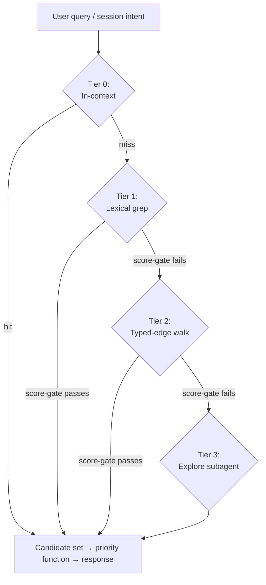

# Architecture

The how and why behind CORE's v2 design. The skill itself is the contract; this doc explains the reasoning that backs it. Every sentence here either describes a decision the architecture rests on or shows you something concrete you can do with it — internal design reasoning that the reader can't act on goes in `core-skill-v2-spec.md` (project repo) instead.

## The reframe

CORE started as a multi-agent adversarial reasoning framework — a `/core` skill that spawned expert persona swarms and used GAN-style generator-critic loops to produce findings single-pass analysis misses.

In May 2026 it reframed (DC-64, 2026-05-16d). The reframe: **CORE is project intelligence in chat with a critic baked in, not a multi-agent framework.** A single competent agent that knows the project's context, watches data sources, remembers across sessions, surfaces decisions and risks proactively, and challenges overconfidence. Multi-agent swarms are one tool the agent reaches for. Not the product.

What changed in practice: the swarm machinery moved from being the default execution path to being an internal protocol (`protocols/analysis.md`) the agent invokes when stakes warrant. The memory architecture went from informal "auto-memory + handoffs + DECISIONS.md" to a structured unit store with typed edges and a four-tier retrieval ladder. PROJECT.md went from hand-edited synthesis to render-from-units with edit-detection and propagation back. Plain voice became the rule the project enforces in seven places (see the explainer at `docs/explainers/overview.md` for the layer list).

The reframe doesn't drop the adversarial discipline. The anti-anchoring rule (Critic frames before reading Generator), the persuasion log, the four named failure modes, the external-audience test — they apply to all reasoning, solo or swarm. The discipline didn't change; the staffing did.

## The memory architecture (the spine)

The architectural spine of v2 is memory storage and retrieval. Everything else organizes around it.

### Two tiers

**Tier 1 — observations** at `<project>/_memories/observations/<YYYY-MM>/obs-<timestamp>-<slug>.md`. Capture-everything. Every utterance, tool output, casual mention. Low-effort YAML frontmatter (id, type, created, session, sources, references-person, references-topic). No edges required at write time.

**Tier 2 — units** at `<project>/_memories/<prefix>-<slug>.md`, flat layout per DC-68. Graduated, reasoned facts. Rich frontmatter (id, type, status, created, updated, confidence, sources, references-person, references-topic, edges, canonical, last_accessed, access_count). Body holds the agent's reasoned reading — synthesis, not raw extract.

The canonical flag (`canonical: true`) marks the top-priority units that surface in PROJECT.md and get a priority floor. Not a separate tier; a marker.

### Six edge types

Edges in unit frontmatter as `{type, target, note?}`. The six committed types are `cites` (generic reference), `supersedes` (replacement), `depends-on` (dependency), `conflicts-with` (contradiction), `references-person` (mentioned person), and `references-topic` (mentioned topic).

Three are eager at write time — `supersedes`, `depends-on`, `conflicts-with` — because retrieval and hygiene depend on them. The other three are eager when clear and lazy otherwise; hygiene's reconciliation pass catches what got missed. Six is the cap; new edge types require a new DC.

### Four-tier retrieval ladder

```
Tier 0 — In-context (already loaded; no retrieval)
   ↓ miss or insufficient
Tier 1 — Lexical (Grep + Read + Glob; keyword-anchored)
   ↓
Tier 2 — Graph walk (typed-edge frontmatter; relational, hop-cap 2-3)
   ↓
Tier 3 — Semantic (Explore subagent reasoning over the vault)
```

Score-gated termination at every transition — the agent decides whether the candidate set is good enough.

Default retrieval excludes observations. Only graduated units surface unless the user explicitly queries observations.

Auto-memory at `~/.claude/projects/*/memory/` is queried alongside `_memories/` at every tier. Complementary, not competing.

### Priority function (DC-69)

```
priority(unit, t) = w_R · R(unit, t)
                  + w_F · F(unit, t)
                  + w_S · S(unit)
                  + w_A · A(unit, t)
                  + P(unit)
```

- **R (recency)** = `exp(-recency_days / τ)`, τ=60 days.
- **F (frequency-across-sources)** = distinct surface-types the unit appears in, normalized by 6.
- **S (source-type weight)** = lookup (PROJECT.md=1.0, configuration=0.9, ops meta=0.7, _handoffs/_outputs=0.5, session logs=0.3, raw transcripts=0.2).
- **A (alignment)** = Jaccard overlap of unit's topics against session-intent topics.
- **P (pinning)** = user-only pin levels (floor=0.7 floor, true=0.9 floor & decay bypassed, always=1.5 alignment-independent).

Starting weights: `w_R=0.30, w_F=0.15, w_S=0.20, w_A=0.35`. Computed at retrieval time over a candidate set, never persisted as a stored ranked list.

### Rendering PROJECT.md from units

PROJECT.md is rendered from canonical units. Three triggers:

1. At `/finalize` — full regeneration.
2. On-demand — any time the user asks.
3. In-session, autonomously — section-level re-render after each meaningful update affecting a section.

Section-level writes, not full-file. The agent reads the current section state, preserves user edits, propagates them back into the source-of-truth units.

The anti-resurrection rule: when the user removes a fact from PROJECT.md, that fact is gone. Don't re-derive it. The corresponding unit's `status` becomes `retired`; hygiene's retire verb fires.

### Edit detection

Hash-based comparison via `~/.core/state-cache.json`. Runs at `/orient`, before autonomous renders, at `/finalize`, on-demand. User edits become ground truth and propagate back to source units.

## Memory hygiene

One unified mechanism, three verbs. Archive moves a unit out of default retrieval but keeps it reachable on demand — trigger is `R · S < 0.05` and no reference in 90 days, surfaced as a user-gated proposal at `/finalize`. Retire flags a unit as no longer current truth while keeping the trace — trigger is explicit supersession or a user-removed PROJECT.md fact, and the unit stays in place with a frontmatter status flip. Cold-store puts the unit fully out-of-band — only deep historical queries reach it, trigger is archived AND retired AND no reference in 365 days.

Plus graduation (observations → units), contradiction reconciliation, index regeneration, file-cap monitoring, continuous self-evaluation.

Runs at `/finalize` (comprehensive), on meaningful changes (lightweight, only what's triggered), on-demand, after PROJECT.md user-edit, on hash mismatch.

Every operation logged twice — narrative in `<project>/autonomous-run-log.md`, machine-readable in `~/.core/hygiene-log.jsonl`. Every operation reversible.

Memory hygiene fully absorbs the v1 "dream cycle" mechanism. Former phases map to hygiene verbs and continuous-self-evaluation; nothing is left as a separate ritual.

## Reasoning discipline (single-agent default)

Single-agent is the default. Most tasks run as one agent doing the work directly, with extended thinking for high-stakes judgment. The reasoning discipline applies whether you're solo or in a swarm.

| Discipline | Solo work | Swarm work |
|---|---|---|
| Anti-anchoring | You read your own predictions before re-reading source material | Critic frames before seeing Generator output |
| Dissent | Push back on user framing when evidence supports | Authorized to contradict any agent's conclusion |
| Persuasion log | Track positions you reversed and why | Mandatory output field; empty is a diagnostic signal |
| Named failure modes | Self-audit at synthesis | Explicit assessment in every effectiveness report |
| External-audience test | Before any claim about people | Same |

### When multi-agent fires

Per `protocols/analysis.md`:

- Stakes warrant the cost — architectural decisions, classification, public-facing copy, graduation reasoning on hard calls.
- Single-pass convergence would be suspect.
- Multiple perspectives genuinely add value.
- Structural commitment the user hasn't endorsed.

Sizing: 3 agents for focused checks, 4–5 for comprehensive review, 3–5 for research investigation. Critic always present. Hardware caps the upper end.

The full multi-agent machinery — phase structure, briefing format, monitor pattern, deep audit gate, output shape — lives in `protocols/analysis.md`.

## Hooks and visible curation

Five hooks make the work visible.

| Hook | What it does |
|---|---|
| SessionStart (global) | Forces `/core` invocation; runs `hygiene-watch.sh` to surface overdue hygiene passes |
| UserPromptSubmit | Injects the plain-voice imperative each turn to counter the coding-assistant baseline |
| PreToolUse Write/Edit | Skill-product guard — requires `intent: skill-edit` declaration for `~/.claude/skills/core/**` writes |
| PostToolUse Write/Edit | Logs every `_memories/` and PROJECT.md touch to the autonomous run log |
| PreCompact | Warns if no handoff has been written since the last PROJECT.md update |
| SessionEnd | Backstop reminder that hygiene needs to fire next session if /finalize was skipped |

Visible curation is a trust signal. The user should always see the agent keeping context fresh — narration as context gets captured, PROJECT.md sections rendering as they change, the autonomous run log appending in real time.

## Validation

The validation regime tests three things:

1. Substrate health (parsing, edges resolving, file integrity).
2. Retrieval convergence (right candidates at the right tier).
3. Priority ranking quality (right ordering on the candidate set).

Test corpus at `<project>/_memories/_validation/tests/test-*.yaml`. Runner at `~/.claude/skills/core/scripts/validate.py`. Thresholds: P,R ≥ 0.8 PASS, ≥ 0.5 INVESTIGATE, < 0.5 FAIL.

Cadence: weekly automatic (via memory hygiene's first /finalize of the week), on-demand, auto-on during retrieval-tuning sessions.

The validation report includes a final qualitative field: *"Did retrieval feel right in real use?"* Quantitative thresholds aren't the whole story.

## Debug mode

Toggle-able logger at `~/.core/debug/<session-id>.jsonl`. Logs every retrieval, unit write, render, hygiene operation, graduation decision, multi-agent invocation in structured form. Flags anomalies inline (unit written but retrieval misses; missing inverse edge; retired fact re-appearing in render; priority function out-of-range; Tier 3 fired when Tier 1 should have caught it; hygiene operation reversed in same session).

Triggers: user says "debug on," agent self-flips during self-unblock, validation runs auto-on.

Lifecycle: per-session, 30-day archive, 90-day cold-store.

## What ships vs. what's development scaffolding

| Surface | Ships? | Lives in |
|---|---|---|
| Skill product | Yes | `~/.claude/skills/core/` → mirrored to `dbatesai/core-skill` |
| Project workshop | No | `~/Documents/Projects/CORE/` (private repo `dbatesai/core`) |
| User's project context | No (user-owned) | `<user-project>/_memories/` + `<user-project>/PROJECT.md` |
| Cross-project operational meta | No (machine-local) | `~/.core/` |
| Auto-memory | No (machine-local) | `~/.claude/projects/<hash>/memory/` |

The skill product is intentionally minimal — protocols, agents, references, scripts, schemas, templates. The project workshop holds session logs, plans, handoffs, IMPROVEMENT_LOG, the spec — all the dev-meta. Two repos by design.

## Diagrams

### The retrieval ladder



### Memory hygiene

```
                ┌──────────────────────────────┐
                │   Continuous self-evaluation │
                │   (under-recall, over-recall,│
                │   stale-surfacing, drift)    │
                └──────────────┬───────────────┘
                               │
                               ▼
   ┌───────────────────────────────────────────────────┐
   │                  Memory Hygiene                    │
   │                                                    │
   │   archive  →  retire  →  cold-store                │
   │     │           │            │                     │
   │     │           │            └─→  out of band      │
   │     │           └────────────────→  no longer true │
   │     └────────────────────────────→  out of default │
   │                                                    │
   │   Plus: graduation, index regen, file-cap monitor  │
   └───────────────────────────────────────────────────┘
                               │
                               ▼
                ┌──────────────────────────────┐
                │   Audit log (run-log +        │
                │   hygiene-log.jsonl)          │
                └──────────────────────────────┘
```

## Where to read next

- `core-skill-v2-spec.md` — the design contract.
- `protocols/data-storage.md` — unit format, edges, retrieval, promotion modes.
- `protocols/hygiene.md` — the three verbs and continuous self-evaluation.
- `protocols/analysis.md` — multi-agent machinery and research mode.
- `protocols/startup.md` — session bootstrap.
- `protocols/execution.md` — execution discipline, solo and swarm.
- `references/retrieval.md` — deeper retrieval ladder detail.
- `references/hygiene-strategies.md` — deeper hygiene sub-protocols.

The eight explainers at `docs/explainers/` (project repo) walk each piece of this architecture in plain voice with diagrams, written for a reader who hasn't seen CORE.
