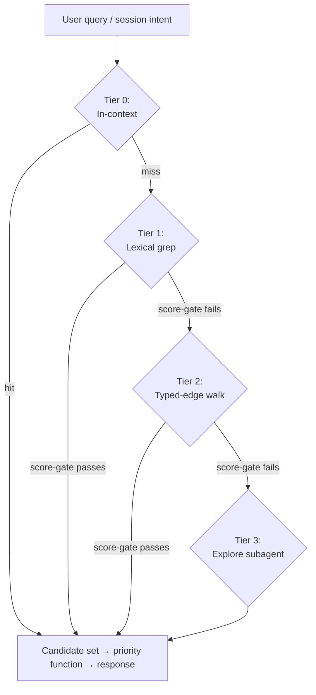

# Architecture

This explains how CORE's v2 design works and why it's built this way. The skill files are the actual contract; this is the reasoning behind them.

## How CORE changed shape

CORE started as a multi-agent reasoning framework — a `/core` skill that spun up expert-persona swarms and ran generator-critic loops to find things a single pass misses.

In May 2026 it changed shape (DC-64, 2026-05-16d). Now it's one capable agent that knows the project, watches its data sources, remembers across sessions, raises decisions and risks before you ask, and argues back when you're too sure. The swarm is still there, but the agent reaches for it as a tool when the stakes call for it, rather than running everything through it.

Three things changed in practice. The swarm machinery moved from the default path to an internal protocol (`protocols/analysis.md`) the agent calls when stakes warrant. Memory went from a loose mix of auto-memory, session summaries, and a `DECISIONS.md` to a structured store of facts with typed links between them and a four-tier way of retrieving them. `PROJECT.md` went from hand-edited to written from those facts, with edits detected and carried back. And plain voice became a rule the project enforces in a few places at once — the top of `SKILL.md`, the protocol headers, a per-turn reminder hook, and the agent's own self-checks.

The argue-it-out discipline didn't go anywhere. The agent still frames its predictions before reading a draft, keeps a log of what changed its mind, audits itself against four named failure modes, and runs the external-audience test before any claim about people. That holds whether it's working alone or in a swarm. What changed was the staffing, not the discipline.

## How memory works

Memory is the heart of the design. Everything else organizes around how facts get stored and found.

### Two tiers

**Tier 1 — observations** at `<project>/_memories/observations/<YYYY-MM>/obs-<timestamp>-<slug>.md`. Capture-everything. Every utterance, tool output, casual mention. Low-effort YAML frontmatter (id, type, created, session, sources, references-person, references-topic). No edges required at write time.

**Tier 2 — units** at `<project>/_memories/<prefix>-<slug>.md`, flat layout per DC-68. Graduated, reasoned facts. Rich frontmatter (id, type, status, created, updated, confidence, sources, references-person, references-topic, edges, canonical, last_accessed, access_count). Body holds the agent's reasoned reading — synthesis, not raw extract.

The canonical flag (`canonical: true`) marks the top-priority units that surface in PROJECT.md and get a priority floor. Not a separate tier; a marker.

### Six edge types

Edges in unit frontmatter as `{type, target, note?}`. The six committed types are `cites` (generic reference), `supersedes` (replacement), `depends-on` (dependency), `conflicts-with` (contradiction), `references-person` (mentioned person), and `references-topic` (mentioned topic).

Three are eager at write time — `supersedes`, `depends-on`, `conflicts-with` — because retrieval and hygiene depend on them. The other three are eager when clear and lazy otherwise; hygiene's reconciliation pass catches what got missed. Six is the cap; new edge types require a new DC.

### Four-tier retrieval ladder

```
Tier 0 — In-context (already loaded; no retrieval)
   ↓ miss or insufficient
Tier 1 — Lexical (Grep + Read + Glob; keyword-anchored)
   ↓
Tier 2 — Graph walk (typed-edge frontmatter; relational, hop-cap 2-3)
   ↓
Tier 3 — Semantic (Explore subagent reasoning over the vault)
```

Score-gated termination at every transition — the agent decides whether the candidate set is good enough.

Default retrieval excludes observations. Only graduated units surface unless the user explicitly queries observations.

Auto-memory at `~/.claude/projects/*/memory/` is queried alongside `_memories/` at every tier. Complementary, not competing.

### Priority function (DC-69)

```
priority(unit, t) = w_R · R(unit, t)
                  + w_F · F(unit, t)
                  + w_S · S(unit)
                  + w_A · A(unit, t)
                  + P(unit)
```

- **R (recency)** = `exp(-recency_days / τ)`, τ=60 days.
- **F (frequency-across-sources)** = distinct surface-types the unit appears in, normalized by 6.
- **S (source-type weight)** = lookup (PROJECT.md=1.0, configuration=0.9, ops meta=0.7, _summaries/_outputs=0.5, session logs=0.3, raw transcripts=0.2).
- **A (alignment)** = Jaccard overlap of unit's topics against session-intent topics.
- **P (pinning)** = user-only pin levels (floor=0.7 floor, true=0.9 floor & decay bypassed, always=1.5 alignment-independent).

Starting weights: `w_R=0.30, w_F=0.15, w_S=0.20, w_A=0.35`. Computed at retrieval time over a candidate set, never persisted as a stored ranked list.

### Rendering PROJECT.md from units

PROJECT.md is rendered from canonical units. Three triggers:

1. At `/finalize` — full regeneration.
2. On-demand — any time the user asks.
3. In-session, autonomously — section-level re-render after each meaningful update affecting a section.

Section-level writes, not full-file. The agent reads the current section state, preserves user edits, propagates them back into the source-of-truth units.

The anti-resurrection rule: when the user removes a fact from PROJECT.md, that fact is gone. Don't re-derive it. The corresponding unit's `status` becomes `retired`; hygiene's retire verb fires.

### Edit detection

Hash-based comparison via `~/.core/state-cache.json`. Runs at session start (`/core`), before autonomous renders, at `/finalize`, on-demand. User edits become ground truth and propagate back to source units; CORE's own renders (the hot-section block, stamped `last_written_by`) are skipped, not mistaken for user edits.

## Memory hygiene

One unified mechanism, three verbs. Archive moves a unit out of default retrieval but keeps it reachable on demand — trigger is `R · S < 0.05` and no reference in 90 days, surfaced as a user-gated proposal at `/finalize`. Retire flags a unit as no longer current truth while keeping the trace — trigger is explicit supersession or a user-removed PROJECT.md fact, and the unit stays in place with a frontmatter status flip. Cold-store puts the unit fully out-of-band — only deep historical queries reach it, trigger is archived AND retired AND no reference in 365 days.

Plus graduation (observations → units), contradiction reconciliation, index regeneration, file-cap monitoring, continuous self-evaluation.

Runs at `/finalize` (comprehensive), on meaningful changes (lightweight, only what's triggered), on-demand, after PROJECT.md user-edit, on hash mismatch.

Every operation is logged twice — in plain prose in `<project>/autonomous-run-log.md`, and machine-readable in `<project>/_sessions/<date>/hygiene-log.jsonl`. Every operation can be undone.

Memory hygiene took over the old v1 "dream cycle" entirely. Its phases became hygiene verbs and self-checks; nothing is left as a separate ritual.

## Reasoning discipline (single-agent default)

Single-agent is the default. Most tasks run as one agent doing the work directly, with extended thinking for high-stakes judgment. The reasoning discipline applies whether you're solo or in a swarm.

| Discipline | Solo work | Swarm work |
|---|---|---|
| Anti-anchoring | You read your own predictions before re-reading source material | Critic frames before seeing Generator output |
| Dissent | Push back on user framing when evidence supports | Authorized to contradict any agent's conclusion |
| Persuasion log | Track positions you reversed and why | Mandatory output field; empty is a diagnostic signal |
| Named failure modes | Self-audit at synthesis | Explicit assessment in every effectiveness report |
| External-audience test | Before any claim about people | Same |

### When multi-agent fires

Per `protocols/analysis.md`:

- Stakes warrant the cost — architectural decisions, classification, public-facing copy, graduation reasoning on hard calls.
- Single-pass convergence would be suspect.
- Multiple perspectives genuinely add value.
- Structural commitment the user hasn't endorsed.

Sizing: 3 agents for focused checks, 4–5 for comprehensive review, 3–5 for research investigation. Critic always present. Hardware caps the upper end.

The full multi-agent machinery — phase structure, briefing format, monitor pattern, deep audit gate, output shape — lives in `protocols/analysis.md`.

## Hooks and visible curation

Two hooks register through the plugin manifest.

| Hook | What it does |
|---|---|
| UserPromptSubmit | Injects the plain-voice imperative each turn to counter the coding-assistant baseline |
| PreToolUse Write/Edit | Skill-product guard — surfaces a Pre-Write Declaration reminder when writes target installed skill paths |

Showing the work is how the agent earns trust. You should always be able to watch it keep context current — saying what it just captured, re-rendering `PROJECT.md` sections as they change, appending to the run log as it goes.

## Validation

The validation regime tests three things:

1. Substrate health (parsing, edges resolving, file integrity).
2. Retrieval convergence (right candidates at the right tier).
3. Priority ranking quality (right ordering on the candidate set).

Test corpus at `<project>/_memories/_validation/tests/test-*.yaml`. Runner at `${CLAUDE_PLUGIN_ROOT}/skills/core/scripts/validate.mjs` (invoke via `node`). Thresholds: P,R ≥ 0.8 PASS, ≥ 0.5 INVESTIGATE, < 0.5 FAIL.

Cadence: weekly automatic (via memory hygiene's first /finalize of the week), on-demand, auto-on during retrieval-tuning sessions.

The validation report includes a final qualitative field: *"Did retrieval feel right in real use?"* Quantitative thresholds aren't the whole story.

## Debug mode

Toggle-able logger at `~/.core/debug/<session-id>.jsonl`. Logs every retrieval, unit write, render, hygiene operation, graduation decision, multi-agent invocation in structured form. Flags anomalies inline (unit written but retrieval misses; missing inverse edge; retired fact re-appearing in render; priority function out-of-range; Tier 3 fired when Tier 1 should have caught it; hygiene operation reversed in same session).

Triggers: user says "debug on," agent self-flips during self-unblock, validation runs auto-on.

Lifecycle: per-session, 30-day archive, 90-day cold-store.

## What ships vs. what lives where

| Surface | Where it lives |
|---|---|
| Skill product (this plugin) | Installed via `/plugin install core@core` into `~/.claude/plugins/cache/<marketplace>/core/<version>/skills/core/`. Legacy direct-install at `~/.claude/skills/core/` is recognized for clone-into-skills users. |
| User's project context | User-owned. `<user-project>/_memories/` plus the rendered `<user-project>/PROJECT.md`. |
| Cross-project operational meta | Machine-local at `~/.core/` — the agent's profile, the workspace registry, the controlled vocabulary, saved agent configs, and cross-project research. |
| Auto-memory | Machine-local at `~/.claude/projects/<hash>/memory/`. Cached, rebuilt each bootstrap. |

The skill product is intentionally minimal — protocols, agents, references, scripts, schemas, templates. Everything else lives in user-owned or machine-local space, by design.

### How scripts get found: `${CLAUDE_PLUGIN_ROOT}`

Every protocol that runs a script calls it as `${CLAUDE_PLUGIN_ROOT}/skills/core/scripts/<name>.mjs`. That environment variable resolves to wherever the plugin manager actually installed the plugin — `~/.claude/plugins/cache/<marketplace>/core/<version>/` for a normal install, or the local directory for `marketplace add ~/path/to/plugin`. Going through the variable means the scripts move with the install and no protocol has to be edited.

If you're building a wrapper — a plugin that mirrors these skills into its own marketplace entry, or any project that layers on top of CORE — this part matters, because getting it wrong breaks every script call silently:

- The wrapper plugin must keep upstream skills at `skills/<skill-name>/` directly under the plugin root — same layout as upstream. Don't nest, don't rename, don't restructure. Wrappers that put the skills at a different relative path (e.g. `wrapped-skills/core/`) silently break every `${CLAUDE_PLUGIN_ROOT}/skills/core/scripts/...` invocation in upstream protocols.
- The wrapper's `${CLAUDE_PLUGIN_ROOT}` resolves to the wrapper's install root, not upstream's. That's correct — the wrapper ships its own copy of the scripts at the same relative path. The contract is "scripts live at `${CLAUDE_PLUGIN_ROOT}/skills/core/scripts/<name>.mjs` relative to whichever plugin is loaded."
- If a wrapper wants to add custom scripts, put them under the wrapper's own skill directory (`skills/<wrapper-skill-name>/scripts/`) and reference via the same `${CLAUDE_PLUGIN_ROOT}` pattern. Don't put custom scripts under `skills/core/` — that's the upstream-mirrored subtree, and the next refresh will overwrite them.

A 2026-05-20 downstream-wrapper migration verified this contract end-to-end. The "verbatim rsync" pattern — `rsync -a --delete --exclude '.git' --exclude '.DS_Store'` per-subtree from `core-plugin/skills/<name>/` into `<wrapper-plugin>/skills/<name>/` — is the supported overlay shape.

### Version vs BUILD — releases vs iterations

The plugin carries two version-shaped identifiers, and they do different work:

Both live in **one file** — `plugins/core/.claude-plugin/plugin.json` is the single source of truth for `version` *and* `build`. The standalone `skills/core/BUILD` file (and the former `skills/core/VERSION`) were folded in; the release bump writes both fields in that file, and CI reads them from there.

- **`version`** — the SemVer string in `plugin.json` (mirrored into `marketplace.json` + the Codex manifest in lockstep, CI-enforced). This is the **release tag**. `claude plugins update <plugin>` checks `version` for changes; if `version` hasn't moved, no refresh happens even if the install on disk is materially behind. Bump `version` for every release the user is meant to update to.
- **`build`** — the date-coded string in `plugin.json` (e.g. `20260601.1`). This is the **iteration tag** — which build of a `version` is installed. The release bump sets it automatically (today's date, `.N` incrementing within a day) whenever `version` is bumped, so it moves with the version and can't drift. The readiness summary reads both from `plugin.json` and echoes "Plugin v\<version\> build \<build\>".

Why both: `version` is the user-facing distribution identifier; bumping it forces every installed copy to pull on next `update`. `build` distinguishes iterations of a single `version`. Keeping them in one file means there is exactly one place to update and nothing to keep in sync.

**Operational rule:** every PR that lands user-visible behavior changes (script flag changes, protocol changes, hook changes, fixes that resolve user-reported issues) bumps `version` at PR-merge time. Sessions that ship pure-dev-meta fixes (test coverage, comment cleanups, archive-only edits) can bump `BUILD` alone — those changes don't need to reach the user-installed copy.

Discovered 2026-05-20: a stale install at `BUILD 20260518.1` with marketplace `version: 2.0.0` did not refresh under `claude plugins update` even though three sessions of fixes had landed with BUILD bumps but no version bump. Bumped to `2.0.1` to force propagation and documented the distinction.

## Diagrams

### The retrieval ladder



### Memory hygiene

```
                ┌──────────────────────────────┐
                │   Continuous self-evaluation │
                │   (under-recall, over-recall,│
                │   stale-surfacing, drift)    │
                └──────────────┬───────────────┘
                               │
                               ▼
   ┌───────────────────────────────────────────────────┐
   │                  Memory Hygiene                    │
   │                                                    │
   │   archive  →  retire  →  cold-store                │
   │     │           │            │                     │
   │     │           │            └─→  out of band      │
   │     │           └────────────────→  no longer true │
   │     └────────────────────────────→  out of default │
   │                                                    │
   │   Plus: graduation, index regen, file-cap monitor  │
   └───────────────────────────────────────────────────┘
                               │
                               ▼
                ┌──────────────────────────────┐
                │   Audit log (run-log +        │
                │   hygiene-log.jsonl)          │
                └──────────────────────────────┘
```

## Where to read next

- `protocols/data-storage.md` — unit format, edges, retrieval, promotion modes.
- `protocols/hygiene.md` — the three verbs and continuous self-evaluation.
- `protocols/analysis.md` — multi-agent machinery and research mode.
- `protocols/startup.md` — session bootstrap.
- `protocols/execution.md` — execution discipline, solo and swarm.
- `references/retrieval.md` — deeper retrieval ladder detail.
- `references/hygiene-strategies.md` — deeper hygiene sub-protocols.
